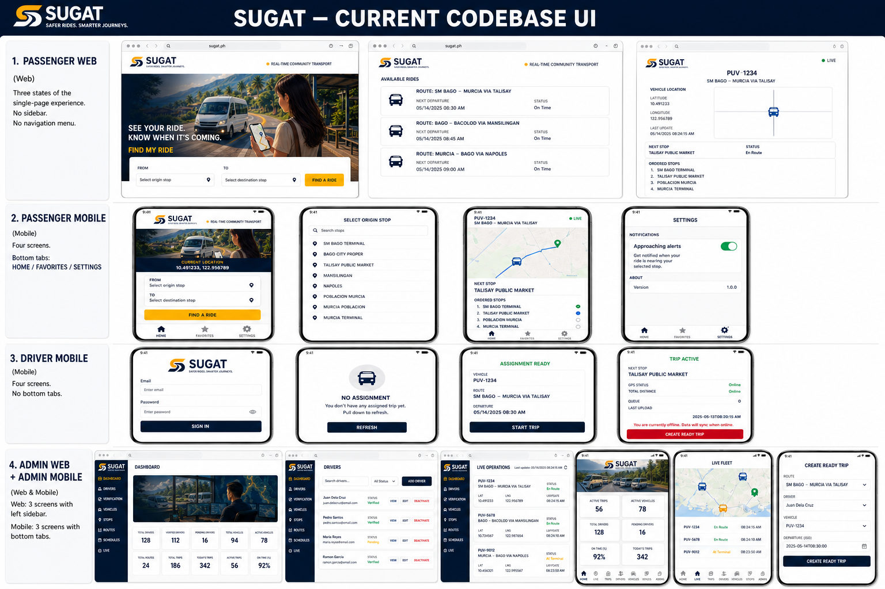

# SUGAT Current-Codebase UI Audit

Current implementation only. The repository source is authoritative; the companion generated board is an overview, not a substitute for pixel-rendered screenshots.



## 1. Repository UI Architecture

| Application | Framework | Entry point | Navigation | Map/realtime |
|---|---|---|---|---|
| Passenger Web | React 18 + Vite | `apps/passenger-web/src/main.tsx` | One state-driven page: search/results or tracking detail | Coordinate panel; Socket.IO trip room. `maplibre-gl` is installed but not rendered. |
| Passenger Mobile | Expo 52 / React Native | `apps/passenger-mobile/App.tsx` | Local bottom tabs: Home, Favorites, Settings; modal stop picker; detail replaces tabs | `react-native-maps`, markers, polyline; Socket.IO trip room |
| Driver Mobile | Expo 52 / React Native | `apps/driver-mobile/App.tsx` | Authenticated state machine: login, no assignment, READY assignment, ACTIVE trip | Background Expo Location queue; no visible map |
| Admin Web | React 18 + Vite | `apps/admin-web/src/main.tsx` | Local sidebar tabs; modal CRUD workflows | Live cards with coordinates; Socket.IO refresh, no map/chart |
| Admin Mobile | Expo 52 / React Native | `apps/admin-mobile/App.tsx` | Bottom tabs: Home, Live, Trips, Drivers, Vehicles, Routes, Assign | `react-native-maps`; Socket.IO admin operations |

The API is not a frontend. It supplies auth, public trip/stops/routes/location, driver assignment/trip/GPS, verification, and admin CRUD/live data.

## 2. Screen Inventory

| Ecosystem | Screen/state | Source | Main components | Status |
|---|---|---|---|---|
| Passenger Web | Search landing | `src/main.tsx` | Header, branded hero, two `StopPicker`s, Find A Ride, results, footer | Implemented |
| Passenger Web | Stop suggestions | `src/main.tsx` | Search input, up to 12 stop buttons, no-match state | Implemented inline |
| Passenger Web | Results/empty/error | `src/main.tsx` | Active-trip cards, ETA, distance, freshness, Track button | Implemented |
| Passenger Web | Live tracking | `src/main.tsx` | Back, vehicle/route, coordinate panel, next stop, status, ordered stops | Implemented; no geographic map |
| Passenger Mobile | Loading/offline/error | `App.tsx` | Spinner, offline banner, alert text | Implemented |
| Passenger Mobile | Home/search/results | `App.tsx` | Hero, current coordinates, origin/destination card, ride cards, bottom tabs | Implemented |
| Passenger Mobile | Stop picker modal | `App.tsx` | Search, active-stop list, empty state, Close | Implemented |
| Passenger Mobile | Trip tracking | `App.tsx` | Hero, native map, polyline, stop/vehicle markers, freshness, next stop, route stops | Implemented |
| Passenger Mobile | Favorites | `App.tsx` | Saved active ride cards/empty state | Implemented, device-local |
| Passenger Mobile | Settings | `App.tsx` | Approaching-alert switch and API limitation note | Implemented |
| Driver Mobile | Restore/login/error | `App.tsx` | Wordmark, email, password, Sign In, server label | Implemented |
| Driver Mobile | No assignment | `App.tsx` | Hero, Bisaya empty message, Refresh | Implemented |
| Driver Mobile | READY assignment | `App.tsx` | Hero, vehicle, route, departure, compliance error, Start Trip | Implemented |
| Driver Mobile | ACTIVE trip | `App.tsx` | Next stop, GPS/internet status, queue/last upload, offline banner, Complete Trip | Implemented |
| Driver Mobile | Completion/logout/settings dialogs | `App.tsx` | Native alerts and device-settings link | Implemented |
| Admin Web | Login | `src/main.tsx` | Logo, tagline, email/password, Sign In | Implemented |
| Admin Web | Dashboard | `src/main.tsx` | Operations hero, live CTA, ten KPI cards | Implemented; no chart/map |
| Admin Web | Drivers | `src/main.tsx` | Search/status filter, cards, add/view/edit/activate actions | Implemented |
| Admin Web | Driver profile modal | `src/main.tsx` | Account, verification, compliance, license, vehicles | Implemented |
| Admin Web | Driver create/edit modal | `src/main.tsx` | Identity, login, phone, photo URL, license fields | Implemented |
| Admin Web | Verification | `src/main.tsx` | Three-file evidence form, protected document viewing, approve/reject cards | Implemented |
| Admin Web | Vehicles | `src/main.tsx` | Search/type/status filters, cards, assignment/edit/status | Implemented |
| Admin Web | Vehicle modal | `src/main.tsx` | Type, name, plate/body, brand/model, capacity, driver | Implemented |
| Admin Web | Stops | `src/main.tsx` | Search, stop cards, coordinates, edit/status | Implemented |
| Admin Web | Stop modal | `src/main.tsx` | Name, description, locality, latitude/longitude | Implemented |
| Admin Web | Routes | `src/main.tsx` | Search, ordered stop chips, edit/reorder/status | Implemented |
| Admin Web | Route builder modal | `src/main.tsx` | Name/direction, add/reorder/remove stops, board/drop-off, minutes | Implemented |
| Admin Web | Schedules/Trips | `src/main.tsx` | Search, table, trip status/id, cancel, Create Schedule | Implemented |
| Admin Web | Schedule modal | `src/main.tsx` | Route, driver, assigned vehicle, departure | Implemented |
| Admin Web | Live | `src/main.tsx` | GPS status/compliance cards, coordinates, last GPS, next stop | Implemented; no map |
| Admin Mobile | Restore/login | `App.tsx` | Secure-session loader, login fields, Sign In | Implemented |
| Admin Mobile | Home/dashboard | `App.tsx` | Hero, eight metrics, Live CTA, bottom tabs | Implemented |
| Admin Mobile | Live fleet | `App.tsx` | Native map, colored markers, GPS/compliance cards | Implemented |
| Admin Mobile | Trips | `App.tsx` | Search and schedule/trip cards | Implemented read-only |
| Admin Mobile | Drivers | `App.tsx` | Search, driver/compliance cards | Implemented read-only |
| Admin Mobile | Vehicles | `App.tsx` | Search and vehicle cards | Implemented read-only |
| Admin Mobile | Routes | `App.tsx` | Search and ordered-stop cards | Implemented read-only |
| Admin Mobile | Create assignment | `App.tsx` | Route/driver/vehicle pickers, ISO departure, Create Ready Trip | Implemented |
| Admin Mobile | Choice modal/offline/error | `App.tsx` | Eligible-record list, mutations-disabled banner, alerts | Implemented |

## 3. Navigation Map

```text
PASSENGER WEB
Search landing → Results → Live tracking → Back

PASSENGER MOBILE
HOME → Stop modal → Results → Trip tracking
├── FAVORITES → Trip tracking
└── SETTINGS

DRIVER MOBILE
Restore session → Login → Assignment
├── no assignment → Refresh
├── READY → Start Trip → ACTIVE
└── ACTIVE → Complete Trip → no assignment

ADMIN WEB
Login → sidebar
├── Dashboard
├── Drivers → View/Create/Edit modal
├── Verification → View/Approve/Reject
├── Vehicles → Create/Edit modal
├── Stops → Create/Edit modal
├── Routes → Create/Edit/Reorder modal
├── Schedules → Create modal/Cancel
└── Live

ADMIN MOBILE
Login → HOME | LIVE | TRIPS | DRIVERS | VEHICLES | ROUTES | ASSIGN
ASSIGN → choice modals → Create Ready Trip
```

## 4. Existing Design System

- Shared theme: navy `#0D1B2A`, gold `#FFB300`, white, background `#F7F8FA`, green `#16875D`, red `#D92D20`, blue `#2563EB`.
- Shared spacing: 4/8/12/16/24/32/40; radii 8/12/18/pill; minimum touch target 48.
- Shared type sizes: hero 40, page 30, section 20, card 17, body 15, caption 12, status 11. Mobile uses system fonts.
- Passenger Web legacy CSS uses DM Sans/Manrope with cream, green, coral, rounded search/results cards.
- Admin Web legacy CSS uses Inter/system with charcoal/green-gray/coral, 230px sticky sidebar, card lists/tables and responsive horizontal nav below 760px.
- Mobile cards are white with 1px gray borders; gold primary actions; red destructive actions.
- Maps exist only in Passenger Mobile and Admin Mobile. Passenger Web tracking is a styled coordinate panel; Admin Web live is a card list.

### Statuses

| Status | Current representation | Used in |
|---|---|---|
| ACTIVE / LIVE | Green | Trips, GPS, active entities |
| READY / PENDING / STALE | Gold or warning chip | Trips, verification, GPS |
| OFFLINE / INACTIVE | Muted gray; mobile offline also uses gold warning banner | Network, GPS, entities |
| FAILED / ERROR | Red | Errors/compliance |
| COMPLETED / CANCELLED / SCHEDULED | Default status chip unless specifically overridden | Schedule/trip views |
| APPROVED | Green | Verification |
| REJECTED | Muted/red context | Verification |
| PENDING_VERIFICATION / PENDING_REVERIFICATION | Warning | Verification |

## 5. Existing Component Inventory

- Passenger Web: `StopPicker`, search/results cards, tracking detail.
- Passenger Mobile: `Shell`, `Hero`, `Card`, `PickerButton`, `Button`, `RideCard`, `TripScreen`, `StopModal`, `Empty`.
- Driver Mobile: `DriverHero`, `Wordmark`, `Shell`, `Action`, `Card`, `Status`, `ErrorMessage`.
- Admin Web: `Toolbar`, `Page`, `Dashboard`, entity lists, `Verification`, `Live`, `Modal`, `EntityForm`, `RouteForm`, `Field`, `Select`, loading/empty states.
- Admin Mobile: `Hero`, `Wordmark`, `Metrics`, `Mini`, `Live`, `List`, `Assignment`, `SelectButton`, `Choice`, `Shell`, `Button`, `Card`, `Chip`, `Center`, `Empty`.

## 6. Passenger Web GUI

Desktop is a centered 1080px single page. The landing state has a 76px header, branded hero, FROM/TO searchable stop fields, one primary action, ride cards, and footer. Tracking replaces the landing state and shows text/coordinates rather than an actual map. At 600px, inputs stack, the live label hides, and result cards wrap.

## 7. Passenger Mobile GUI

Home, Favorites, and Settings use bottom tabs. Home combines the passenger hero with current device coordinates, a stop selection card, and live result cards. Trip tracking uses a real native map with the route polyline and markers. Favorites are local-only; approaching alerts are local notifications while tracking.

## 8. Driver Mobile GUI

There is no driver map. The UI is operational and state-based: login, no assignment, READY assignment, or ACTIVE trip. ACTIVE shows next stop, GPS process state, connectivity, queue depth, last upload, offline continuity warning, and a destructive completion action.

## 9. Admin Web GUI

The sidebar has exactly Dashboard, Drivers, Verification, Vehicles, Stops, Routes, Schedules, and Live. Dashboard is KPI-only. CRUD uses cards, one schedule table, and overlays; route editing has ordered stops and boarding/drop-off flags. Live operations is a coordinate/status card list, not a map.

## 10. Full SUGAT Ecosystem Board

Companion asset: `docs/ui/sugat-current-codebase-ecosystem-board.png`. It was generated with the built-in image tool using the official logo and existing passenger/driver/admin hero assets as references. Treat labels or decorative map details in the generated overview as illustrative; the inventory above is authoritative.

## 11. Individual Image-Generation Prompts

Use this invariant for every prompt: **current implementation only; preserve official logo; no invented fields, routes, analytics, fares, ratings, seats, fuel, chat, or payments.**

1. **Passenger Web — Search:** 1440px browser, centered 1080px cream/green/coral page, exact header, official logo, current branded hero, FROM and TO searchable stop fields, FIND A RIDE, empty results message, footer.
2. **Passenger Web — Results:** same shell, populated result cards containing vehicle type/display name, route/direction, ETA, boarding stop, distance, freshness, updated time, TAN-AWA LIVE.
3. **Passenger Web — Tracking:** browser with BALIK, SUGAT, live freshness, vehicle/route, coordinate panel, next stop, status and ordered route list; explicitly no geographic map.
4. **Passenger Mobile — Home:** 390px phone, actual passenger hero, current-location coordinates, FROM/TO picker card, FIND A RIDE, ACTIVE RIDES, HOME/FAVORITES/SETTINGS tabs.
5. **Passenger Mobile — Stop Modal:** full-screen native modal, Choose origin, Close, searchable active-stop list and locality subtitles.
6. **Passenger Mobile — Tracking:** phone with Back to Rides, compact hero, native map/polyline/stop markers/vehicle marker, GPS freshness, next stop, favorite star, ordered route stops.
7. **Passenger Mobile — Favorites:** compact Saved Rides hero, saved active RideCards or exact empty message, bottom tabs.
8. **Passenger Mobile — Settings:** compact Passenger Settings hero, Approaching alerts switch and no-account/server-push limitation note.
9. **Driver Mobile — Login:** phone, official logo plus DRIVER, WHERE JOURNEYS MEET, Driver Login, email/password, SIGN IN, server label.
10. **Driver Mobile — No Assignment:** phone with driver hero, NO CURRENT ASSIGNMENT/STAY READY, Bisaya empty state and REFRESH.
11. **Driver Mobile — READY:** hero saying READY ASSIGNMENT and READY FOR YOUR NEXT TRIP?, assigned vehicle, route, departure, START TRIP.
12. **Driver Mobile — ACTIVE:** hero saying ACTIVE TRIP/YOUR TRIP IS LIVE, next stop, GPS/Internet cards, location queue and last upload, COMPLETE TRIP.
13. **Admin Web — Login:** centered white login card on charcoal background, official logo, Operations login, email/password and coral SIGN IN.
14. **Admin Web — Dashboard:** 1440px browser, 230px charcoal sidebar with exact eight tabs, operations hero and ten real KPI cards; no chart or map.
15. **Admin Web — Drivers:** sidebar shell, search/status filter, Add Driver, driver record cards and View/Edit/Deactivate actions; include separate profile and create/edit modal variants.
16. **Admin Web — Verification:** evidence upload form with driver and three private documents; submission cards with protected View, Approve, Reject.
17. **Admin Web — Vehicles:** search/type/status filters, Add Vehicle, vehicle/driver/capacity cards; create/edit/assign modal.
18. **Admin Web — Stops:** search, Add Stop, active/inactive cards with locality and six-decimal coordinates; stop modal.
19. **Admin Web — Routes:** search, Add Route, ordered stop chips and Edit/Reorder; wide route-builder modal with board/drop-off/minutes controls.
20. **Admin Web — Schedules/Trips:** schedule table with Departure, Route, Driver, Vehicle, Trip, Action; create schedule modal and Cancel.
21. **Admin Web — Live:** live operation cards with trip/GPS status, compliance alert, vehicle, route, driver, next stop, coordinates, last GPS and ETA unavailable; no map.
22. **Admin Mobile — Login:** phone, official wordmark, Admin operations, authorized-only note, fields and gold SIGN IN.
23. **Admin Mobile — Home:** actual admin hero, OPERATIONS IN YOUR HAND., active trips/GPS stale, eight two-column metric cards and exact seven bottom tabs.
24. **Admin Mobile — Live:** native fleet map with markers colored by GPS/compliance plus live fleet cards.
25. **Admin Mobile — Trips/Drivers/Vehicles/Routes:** create one phone variant per list using Search real records and the exact card fields from the inventory.
26. **Admin Mobile — Assign:** route, driver, assigned vehicle selectors, ISO departure input and CREATE READY TRIP; include the native choice modal variant.

## 12. UI Consistency Audit

- Web and mobile palettes are visibly inconsistent; web retains older brand colors.
- Passenger Web headline/terminology mixes English and Bisaya; Passenger Mobile mostly uses English except underlying brand copy.
- Admin Web has no map while Admin Mobile does.
- Passenger Web lists coordinates as a “map”; Passenger Mobile renders a true map.
- Admin Web uses card lists/table/modal CRUD; Admin Mobile management screens are mostly read-only cards.
- Web radii/buttons use 6–18px legacy values; mobile consistently uses shared 8/12/18px radii and gold actions.
- Official logo image embeds “SAFER RIDES. SMARTER JOURNEYS.” while the code-level tagline is “WHERE JOURNEYS MEET.” Both appear in the current ecosystem.
- The generated overview board may visually normalize these differences; source-rendered UI does not.

## 13. Missing / Incomplete UI

- No dedicated passenger account, profile, login, ticketing, fare, payment, seat availability, chat, or rating UI.
- Passenger Web imports a map package but renders no actual map.
- Admin Web has no analytics chart or live map.
- Driver Mobile has no visible map or route polyline.
- Admin Mobile has no Verification, Stops, driver/vehicle/route CRUD, or protected-document review screen.
- Passenger favorites persist only on-device and only show rides from current in-memory results.
- No React Router or React Navigation route stack; all applications use local state.
- No explicit web pagination or delete workflow; entity deactivation is used.

## 14. Proposed Improvements

Not included in the current-state visualization. Any future redesign should begin by reconciling web/mobile tokens, tagline usage, map expectations, responsive navigation, and cross-platform feature parity without altering the current audit.

